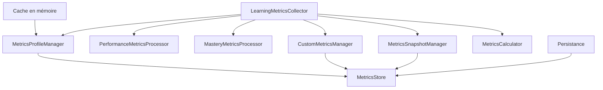

# Module de Métriques d'Apprentissage

## Description

Le module de métriques d'apprentissage fournit un système complet de collecte, analyse et gestion des métriques pour le système MetaSign. Il permet de suivre la progression, la performance et l'engagement des utilisateurs dans leur parcours d'apprentissage de la LSF.

## Architecture

### Vue d'ensemble



### Composants Principaux

#### 1. LearningMetricsCollector (Orchestrateur)
- **Responsabilité** : Coordonne tous les services de métriques
- **Fonctions principales** :
  - Enregistrement des résultats d'exercices
  - Gestion des sessions d'apprentissage
  - Synchronisation avec les profils d'apprentissage

#### 2. MetricsProfileManager
- **Responsabilité** : Gestion des profils utilisateur avec cache optimisé
- **Caractéristiques** :
  - Cache TTL configurable
  - Création automatique de profils
  - Transformation entre formats

#### 3. MetricsCalculator
- **Responsabilité** : Tous les calculs mathématiques
- **Calculs disponibles** :
  - Moyennes glissantes
  - Vitesse de progression
  - Estimation de niveaux
  - Priorités de lacunes

#### 4. Processeurs de Métriques

##### PerformanceMetricsProcessor
- Score moyen
- Taux de réussite
- Scores par compétence/type/niveau
- Score de précision

##### MasteryMetricsProcessor
- Classification des compétences (maîtrisées/en cours/faibles)
- Score de rétention
- Courbe d'oubli
- Taux de réacquisition

#### 5. CustomMetricsManager
- Création de métriques personnalisées
- Validation des métriques
- Limite configurable par utilisateur

#### 6. MetricsSnapshotManager
- Snapshots automatiques après exercices
- Snapshots de session
- Historique des métriques

## Utilisation

### Installation et Configuration

```typescript
import { createMetricsCollector } from '@/ai/services/learning/metrics';

// Configuration par défaut
const collector = createMetricsCollector();

// Configuration personnalisée
const collector = createMetricsCollector({
    rollingAverageWindow: 20,      // Fenêtre pour moyennes glissantes
    successThreshold: 0.6,          // Seuil de réussite
    cacheTTL: 60000,               // Durée cache (ms)
    enableAutoSnapshots: true,      // Snapshots automatiques
    snapshotInterval: 5            // Intervalle snapshots (min)
});
```

### Enregistrement d'un Résultat d'Exercice

```typescript
const exerciseResult: ExerciseResult = {
    userId: 'user123',
    exerciseId: 'ex456',
    date: new Date(),
    score: 0.85,
    skillScores: {
        'handshape': 0.9,
        'movement': 0.8,
        'location': 0.85
    },
    exerciseType: 'SigningPractice',
    userLevel: 'B1'
};

const updatedProfile = await collector.recordExerciseResult(
    userId, 
    exerciseResult
);
```

### Gestion des Sessions

```typescript
// Enregistrer une session complète
const session: LearningSession = {
    sessionId: 'session789',
    userId: 'user123',
    startTime: new Date('2025-05-24T10:00:00'),
    endTime: new Date('2025-05-24T10:30:00'),
    stats: {
        exercisesCompleted: 5,
        correctAnswers: 4,
        totalQuestions: 5
    }
};

await collector.recordSessionMetrics(session);
```

### Métriques Personnalisées

```typescript
// Créer une métrique personnalisée
const customMetric = await collector.createCustomMetric(userId, {
    id: 'study_streak',
    name: 'Jours consécutifs',
    description: 'Nombre de jours d\'étude consécutifs',
    type: 'count',
    category: 'engagement',
    value: 0
});

// Mettre à jour la métrique
await collector.updateCustomMetric(
    userId, 
    'study_streak', 
    7,
    { lastStudyDate: new Date() }
);
```

### Récupération des Métriques

```typescript
// Profil complet
const profile = await collector.getUserMetricsProfile(userId);

// Métriques spécifiques
const metrics = await collector.getUserMetrics(userId, [
    'performance.averageScore',
    'mastery.masteredSkillsCount',
    'engagement.usageFrequency'
]);

// Historique d'une métrique
const history = await collector.getMetricHistory(
    userId,
    'performance.averageScore',
    {
        startDate: new Date('2025-05-01'),
        endDate: new Date('2025-05-24'),
        limit: 100
    }
);
```

## Types de Métriques

### Métriques de Performance
- **averageScore** : Score moyen global (0-1)
- **successRate** : Taux de réussite (0-1)
- **accuracyScore** : Score de précision/constance (0-1)
- **skillScores** : Scores par compétence
- **exerciseTypeScores** : Scores par type d'exercice
- **levelScores** : Scores par niveau CECRL

### Métriques d'Engagement
- **usageFrequency** : Sessions par semaine
- **averageSessionDuration** : Durée moyenne (minutes)
- **exercisesPerSession** : Exercices par session
- **totalLearningTime** : Temps total (minutes)

### Métriques de Progression
- **currentLevel** : Niveau CECRL actuel
- **progressInCurrentLevel** : Progression dans le niveau (0-1)
- **progressionSpeed** : Vitesse (niveaux/mois)
- **levelHistory** : Historique des niveaux

### Métriques de Maîtrise
- **masteredSkills** : Compétences maîtrisées
- **retentionScore** : Score de rétention (0-1)
- **forgettingCurveHalfLife** : Demi-vie (jours)
- **conceptMasteryScores** : Scores par concept

### Métriques Émotionnelles
- **confidenceScore** : Confiance (0-1)
- **motivationScore** : Motivation (0-1)
- **frustrationLevel** : Frustration (0-1)
- **resilienceScore** : Résilience (0-1)

## Configuration Avancée

### Personnalisation des Seuils

```typescript
const processor = new PerformanceMetricsProcessor({
    successThreshold: 0.7,      // Exercice réussi si score > 70%
    rollingWindowSize: 10       // Moyenne sur 10 derniers résultats
});
```

### Gestion du Cache

```typescript
const profileManager = new MetricsProfileManager(store, {
    ttl: 120000,        // Cache 2 minutes
    maxSize: 500        // Max 500 profils en cache
});
```

### Configuration des Snapshots

```typescript
const snapshotManager = new MetricsSnapshotManager(store, {
    autoSnapshotMetrics: [
        'performance.averageScore',
        'progression.currentLevel'
    ],
    snapshotPerExercise: true,
    minSnapshotInterval: 300000  // 5 minutes
});
```

## Bonnes Pratiques

1. **Utiliser la factory** : Préférer `createMetricsCollector()` pour la configuration
2. **Gérer les erreurs** : Toutes les méthodes async peuvent lever des exceptions
3. **Limiter les métriques personnalisées** : Maximum 50 par utilisateur par défaut
4. **Optimiser les requêtes** : Utiliser les filtres pour l'historique
5. **Cache intelligent** : Le cache se vide automatiquement selon le TTL

## Performance

- **Cache en mémoire** : Réduit les accès au store
- **Moyennes glissantes** : Évite de stocker toutes les valeurs
- **Snapshots différés** : Intervalle minimum entre snapshots
- **Calculs optimisés** : Algorithmes efficaces pour les statistiques

## Intégration avec le Système

Le module s'intègre avec :
- **LearningService** : Pour les sessions et exercices
- **ReverseApprenticeshipSystem** : Pour les profils d'apprentissage
- **GamificationManager** : Pour les récompenses basées sur les métriques
- **PyramideIA** : Pour l'analyse avancée des performances

## Exemples Complets

### Dashboard de Progression

```typescript
async function getUserDashboard(userId: string) {
    const profile = await collector.getUserMetricsProfile(userId);
    const metrics = await collector.getUserMetrics(userId, [
        'performance.averageScore',
        'progression.currentLevel',
        'mastery.masteredSkillsCount',
        'engagement.totalLearningTime'
    ]);
    
    return {
        level: metrics.find(m => m.id === 'progression.currentLevel')?.value,
        score: Math.round(metrics.find(m => m.id === 'performance.averageScore')?.value * 100),
        skills: metrics.find(m => m.id === 'mastery.masteredSkillsCount')?.value,
        time: formatDuration(metrics.find(m => m.id === 'engagement.totalLearningTime')?.value)
    };
}
```

### Rapport de Performance

```typescript
async function generatePerformanceReport(userId: string, days: number = 30) {
    const startDate = new Date();
    startDate.setDate(startDate.getDate() - days);
    
    const scoreHistory = await collector.getMetricHistory(
        userId,
        'performance.averageScore',
        { startDate, endDate: new Date() }
    );
    
    const profile = await collector.getUserMetricsProfile(userId);
    
    return {
        period: `${days} derniers jours`,
        averageScore: profile.performance.averageScore,
        scoreEvolution: calculateTrend(scoreHistory),
        strengths: profile.mastery.masteredSkills,
        weaknesses: profile.mastery.weaknessSkills
    };
}
```

## Troubleshooting

### Problème : Cache non synchronisé
**Solution** : Invalider le cache manuellement
```typescript
profileManager.invalidateCache(userId);
```

### Problème : Métriques manquantes
**Solution** : Vérifier que le profil existe
```typescript
const profile = await collector.getUserMetricsProfile(userId);
if (!profile) {
    // Créer un nouveau profil
}
```

### Problème : Performance dégradée
**Solution** : Ajuster la configuration du cache et des snapshots
```typescript
const collector = createMetricsCollector({
    cacheTTL: 300000,         // 5 minutes
    snapshotInterval: 10,     // 10 minutes
    enableAutoSnapshots: false // Désactiver si nécessaire
});
```