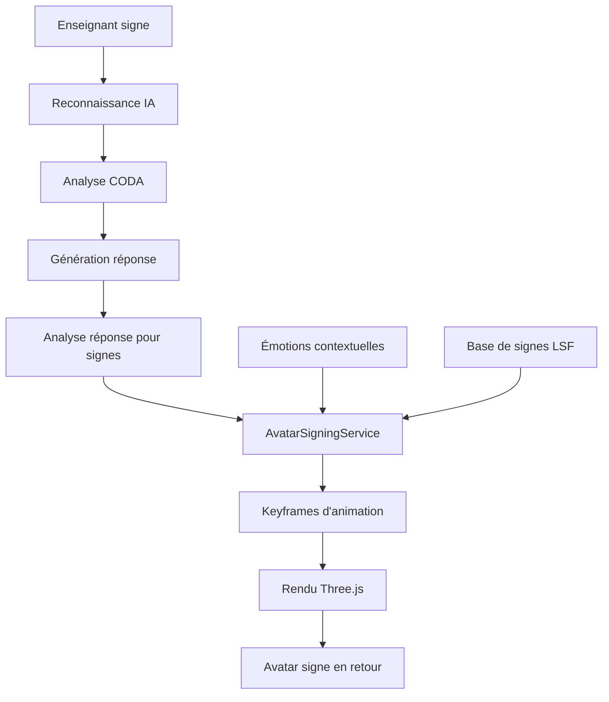

# 🤖 Avatar 3D CODA - Système de Signes LSF

## 🎯 **Vue d'ensemble**

L'avatar 3D CODA est un système d'apprentissage bidirectionnel qui permet à l'IA apprenante de **signer en retour** à l'enseignant. Il complète le système vidéo multimodal en ajoutant une dimension visuelle aux réponses de l'IA.

---

## 🏗️ **Architecture Avatar**



---

## 🎭 **Fonctionnalités Avatar**

### **Signes Disponibles**
- ✅ **bonjour** - Salutation d'accueil
- ✅ **merci** - Remerciement
- ✅ **oui** - Confirmation
- ✅ **non** - Négation  
- ✅ **au_revoir** - Salutation de départ

### **États Émotionnels**
- 😊 **happy** - Content, satisfait
- 🤩 **excited** - Enthousiaste, émerveillé  
- 🤔 **curious** - Curieux, interrogatif
- 😕 **confused** - Perdu, incertain
- 😐 **neutral** - Neutre, au repos
- 🎯 **focused** - Concentré, attentif

### **Animations Temps Réel**
- Mouvement fluide des mains et doigts
- Expressions faciales contextuelles
- Posture corporelle adaptée
- Direction du regard interactive

---

## 🚀 **Utilisation**

### **Avatar Seul**
```tsx
import { CODAAvatar3D } from '@/learning/video';

function AvatarDemo() {
  return (
    <CODAAvatar3D
      isActive={true}
      currentSign="bonjour"
      emotional="excited"
      onSignCompleted={(sign) => console.log('Terminé:', sign)}
      showDebugInfo={true}
    />
  );
}
```

### **Avec Hook d'Animation**
```tsx
import { useAvatarSigning } from '@/learning/video';

function ControlledAvatar() {
  const avatar = useAvatarSigning();

  const handlePlaySign = async () => {
    await avatar.playSign('bonjour');
    avatar.setEmotional('happy');
  };

  const handleSequence = async () => {
    await avatar.playSignSequence(['bonjour', 'merci'], 1000);
  };

  return (
    <div>
      <CODAAvatar3D
        isActive={avatar.isInitialized}
        currentSign={avatar.currentSign}
        emotional={avatar.emotional}
      />
      <button onClick={handlePlaySign}>Dire Bonjour</button>
      <button onClick={handleSequence}>Séquence</button>
    </div>
  );
}
```

### **Intégration Complète (Studio)**
```tsx
import { MultimodalLearningStudio } from '@/learning/video';

function App() {
  return (
    <MultimodalLearningStudio 
      teacherId="teacher123"
    />
  );
}
```

---

## 🔧 **API Avatar**

### **CODAAvatar3D Props**
```typescript
interface CODAAvatar3DProps {
  isActive?: boolean;                    // Avatar actif
  currentSign?: string;                  // Signe en cours
  emotional?: 'neutral' | 'happy' | 'confused' | 'excited' | 'focused';
  onSignCompleted?: (signName: string) => void;
  onAvatarReady?: () => void;
  className?: string;
  showDebugInfo?: boolean;               // Panneau de debug
}
```

### **useAvatarSigning Hook**
```typescript
const avatar = useAvatarSigning();

// États
avatar.isInitialized      // Prêt à utiliser
avatar.isPlaying         // Animation en cours
avatar.currentSign       // Signe actuel
avatar.emotional         // État émotionnel
avatar.availableSigns    // Liste des signes

// Actions
await avatar.playSign('bonjour');
await avatar.playSignSequence(['oui', 'merci'], 800);
avatar.setEmotional('excited');
avatar.stopCurrent();
avatar.resetToNeutral();
```

---

## 🧠 **Intelligence Contextuelle**

### **Réactions Automatiques**
L'avatar réagit automatiquement aux événements :

```typescript
// Reconnaissance de signe par l'enseignant
if (sign.confidence > 0.9) {
  avatar.setEmotional('excited');    // Très content
  await avatar.playSign(sign.name);  // Répète le signe
} else if (sign.confidence > 0.7) {
  avatar.setEmotional('focused');    // Concentré
} else {
  avatar.setEmotional('confused');   // Incertain
}
```

### **Analyse des Réponses CODA**
```typescript
// L'avatar analyse les réponses textuelles pour extraire :
const response = "Super ! Je vois le signe 'bonjour' ! Merci !";

// Détection automatique :
// - Émotion : "excited" (à cause de "Super !")
// - Signes à jouer : ["bonjour", "merci"]
// - Action : Avatar signe en séquence
```

### **Contextes d'Interaction**

| **Contexte** | **Émotion** | **Signes** | **Comportement** |
|--------------|-------------|------------|------------------|
| Démarrage session | `excited` | `bonjour` | Salue l'enseignant |
| Signe reconnu (>90%) | `excited` | Répète le signe | Confirme la compréhension |
| Signe reconnu (70-90%) | `focused` | Aucun | Reste attentif |
| Signe mal reconnu (<70%) | `confused` | Aucun | Montre l'incertitude |
| Fin de session | `neutral` | `au_revoir` | Dit au revoir |
| Réponse positive CODA | `happy` | Selon contexte | Signe la joie |

---

## 🎨 **Système d'Animation**

### **Keyframes et Interpolation**
```typescript
interface SignKeyframe {
  timestamp: number;                    // Position temporelle
  leftHand: HandPosition;              // Position main gauche
  rightHand: HandPosition;             // Position main droite
  leftFingers: FingerConfiguration;    // Configuration doigts gauche
  rightFingers: FingerConfiguration;   // Configuration doigts droite
  faceExpression?: string;             // Expression faciale
  bodyPosture?: {                      // Posture corporelle
    shoulderTilt: number;
    headTilt: number;
    eyeDirection: { x: number; y: number };
  };
}
```

### **Exemple Signe "Bonjour"**
```typescript
const bonjourKeyframes = [
  {
    timestamp: 0.0,
    rightHand: { x: 1.2, y: 1.5, z: 0.3, rotationY: -0.3 },
    rightFingers: { thumb: 1, index: 1, middle: 1, ring: 1, pinky: 1 },
    faceExpression: 'happy'
  },
  {
    timestamp: 0.5,
    rightHand: { x: 1.2, y: 1.8, z: 0.5, rotationY: 0 },
    rightFingers: { thumb: 1, index: 1, middle: 1, ring: 1, pinky: 1 }
  }
];
```

---

## 📊 **Métriques et Debug**

### **Panneau de Debug**
Quand `showDebugInfo={true}` :
- État actuel (Animation/Repos)
- Signe en cours d'exécution
- Émotion courante
- Présence de keyframe

### **Console Logs**
```typescript
// Logs automatiques
console.log('Avatar CODA prêt');
console.log('Avatar a terminé le signe:', signName);
console.log('Session multimodale démarrée:', sessionId);
```

### **Métriques Performance**
- Framerate d'animation : 20 FPS (50ms par frame)
- Délai séquence par défaut : 800ms entre signes
- Interpolation : Lissage automatique entre keyframes

---

## 🔧 **Configuration Avancée**

### **Personnaliser les Signes**
```typescript
// Ajouter de nouveaux signes dans AvatarSigningService
const nouveauSigne: SignKeyframe[] = [
  {
    timestamp: 0.0,
    leftHand: { x: -1.2, y: 1.0, z: 0.2 },
    rightHand: { x: 1.2, y: 1.0, z: 0.2 },
    // ... définition complète
  }
];

signDatabase.set('nouveau_signe', nouveauSigne);
```

### **Modifier les Émotions**
```typescript
// Dans CODAAvatar3D.tsx
const getEmotionalColor = () => {
  switch (emotional) {
    case 'happy': return '#FFE4B5';     // Beige chaud
    case 'excited': return '#FFB6C1';   // Rose clair
    case 'confused': return '#F0F8FF';  // Bleu Alice
    case 'focused': return '#E6E6FA';   // Lavande
    default: return '#FAEBD7';          // Blanc antique
  }
};
```

### **Ajuster l'Analyse CODA**
```typescript
// Dans MultimodalLearningStudio.tsx
const analyzeResponseForSigns = (response: string) => {
  // Personnaliser la détection d'émotions
  if (response.includes('Bravo')) {
    result.emotion = 'excited';
  }
  
  // Ajouter de nouveaux déclencheurs de signes
  if (response.includes('s\'il te plaît')) {
    result.signsToPlay.push('s_il_te_plait');
  }
  
  return result;
};
```

---

## 🛠️ **Développement**

### **Dépendances**
```json
{
  "three": "^0.150.0",
  "@react-three/fiber": "^8.0.0",
  "@react-three/drei": "^9.0.0"
}
```

### **Structure Fichiers**
```
learning/
├── services/
│   └── AvatarSigningService.ts      # Logique animation
├── hooks/
│   └── useAvatarSigning.ts          # Hook React
├── components/
│   └── CODAAvatar3D.tsx             # Composant 3D
└── video/
    └── AVATAR_README.md             # Cette documentation
```

### **Tests Recommandés**
1. **Test Animation** : Vérifier fluidité des signes
2. **Test Émotions** : Valider changements d'expression
3. **Test Séquences** : Contrôler enchaînements
4. **Test Intégration** : Réponses CODA → Signes avatar

---

## 🎯 **Roadmap Avatar**

- [ ] **Reconnaissance gestuelle avancée** - Plus de signes LSF
- [ ] **Expressions faciales détaillées** - Sourcils, sourire, etc.
- [ ] **Animations de transition** - Mouvements plus naturels
- [ ] **Avatar personnalisable** - Choix apparence/style
- [ ] **Mode multi-avatars** - Plusieurs IA apprenantes
- [ ] **Export animations** - Sauvegarde des séquences

---

## 📞 **Support Avatar**

Pour toute question sur l'avatar 3D :
- 📧 Email: avatar@metasign.com
- 💬 Discord: #avatar-3d-coda
- 📖 Docs: https://docs.metasign.com/avatar

**L'IA qui apprend ET qui signe ! 🤖✋✨**