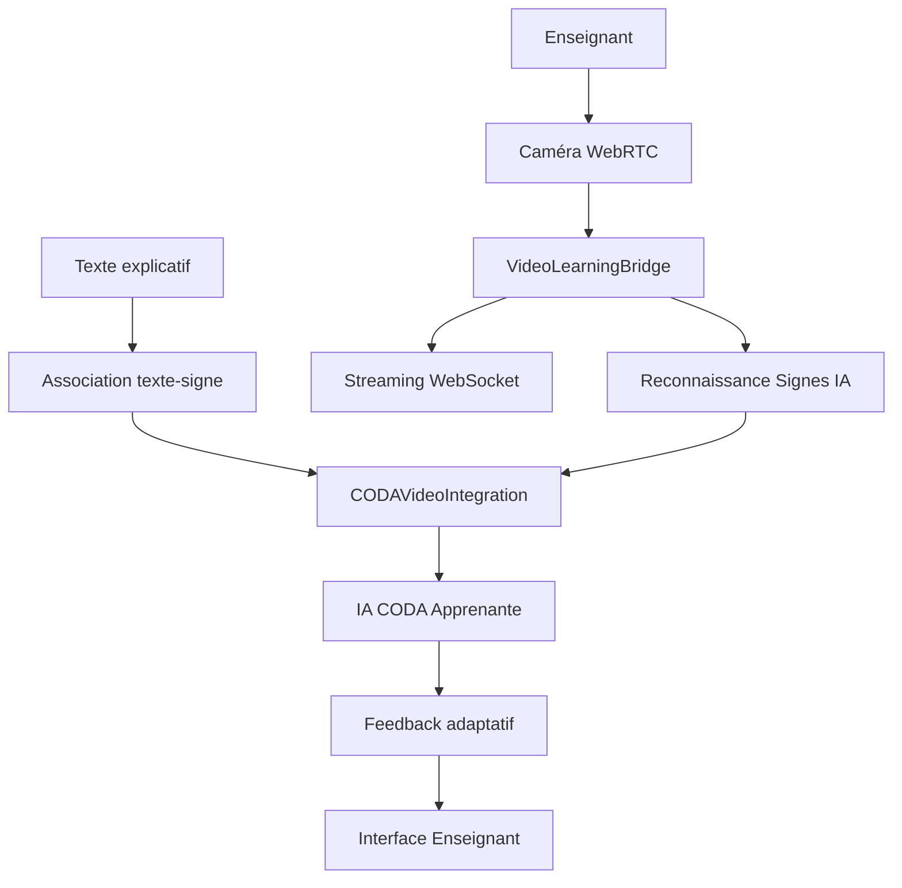

# 🎥 Système d'Apprentissage Vidéo Multimodal LSF

## 🎯 **Vue d'ensemble**

Ce système permet l'apprentissage LSF **multimodal** en combinant :
- **Vidéo temps réel** (enseignant qui signe)
- **Reconnaissance de signes IA**
- **Association texte ↔ signe**
- **Apprentissage IA CODA** adaptatif

---

## 🏗️ **Architecture**



---

## 📁 **Structure des Fichiers**

```
video/
├── services/
│   ├── VideoLearningBridge.ts      # Capture vidéo + reconnaissance
│   └── CODAVideoIntegration.ts     # Intégration avec IA CODA
├── hooks/
│   └── useVideoLearning.ts         # Hook React pour vidéo
├── components/
│   ├── TeacherVideoInterface.tsx   # Interface enseignant
│   └── MultimodalLearningStudio.tsx # Studio complet
└── index.ts                        # Exports
```

---

## 🚀 **Utilisation Rapide**

### **Studio Complet**
```tsx
import { MultimodalLearningStudio } from '@/learning/video';

function App() {
  return (
    <MultimodalLearningStudio 
      teacherId="teacher123"
    />
  );
}
```

### **Interface Enseignant Seule**
```tsx
import { TeacherVideoInterface } from '@/learning/video';

function TeacherApp() {
  return (
    <TeacherVideoInterface
      teacherId="teacher123"
      onSignRecognized={(sign) => console.log('Signe:', sign.signName)}
      onSessionStart={(sessionId) => console.log('Session:', sessionId)}
    />
  );
}
```

### **Hook Vidéo Personnalisé**
```tsx
import { useVideoLearning } from '@/learning/video';

function CustomVideoComponent() {
  const video = useVideoLearning();
  
  const startSession = async () => {
    await video.startSession({
      teacherId: 'teacher123',
      topic: 'Salutations',
      targetLevel: 'A2'
    });
  };

  return (
    <div>
      <video ref={video.videoElementRef} />
      <button onClick={startSession}>Démarrer</button>
      <button onClick={video.startRecording}>Enregistrer</button>
    </div>
  );
}
```

---

## 🔧 **Configuration**

### **Prérequis**
- **WebRTC** supporté (Chrome, Firefox, Safari)
- **Caméra + Microphone** autorisés
- **WebSocket** serveur (optionnel)

### **Configuration Vidéo**
```typescript
const videoConfig = {
  width: 1280,
  height: 720,
  frameRate: 30,
  facingMode: 'user',
  enableAudio: true
};

await video.startSession({
  teacherId: 'teacher123',
  topic: 'Numbers',
  targetLevel: 'A1',
  videoConfig
});
```

### **WebSocket (Optionnel)**
```typescript
const video = useVideoLearning('ws://localhost:8080/video-learning');
```

---

## 🤖 **Reconnaissance de Signes**

### **Signes Supportés**
- ✅ **Lettres** (A-Z)
- ✅ **Mots courants** (bonjour, merci, oui, non)
- ✅ **Nombres** (1-10)
- ✅ **Phrases simples**

### **Niveaux de Confiance**
- **> 80%** : Signe très clair ✅
- **50-80%** : Signe reconnu avec doute 🤔
- **< 50%** : Signe difficile à identifier ❓

### **Données Retournées**
```typescript
interface SignRecognitionResult {
  signId: string;
  signName: string;           // "bonjour", "merci", etc.
  confidence: number;         // 0.0 - 1.0
  timestamp: number;
  handPoses: HandPose[];     // Coordonnées des mains
  description: string;
  category: 'letter' | 'word' | 'phrase' | 'number';
}
```

---

## 🧠 **Intégration IA CODA**

### **Apprentissage Multimodal**
L'IA CODA apprend en associant :
- **Texte** explicatif de l'enseignant
- **Signes** reconnus en vidéo
- **Context** temporel et séquentiel

### **Feedback Adaptatif**
```typescript
interface CODAFeedback {
  understanding: number;           // Niveau de compréhension 0-1
  questions: string[];             // Questions posées par l'IA
  emotionalResponse: 'curious' | 'confused' | 'excited' | 'frustrated';
  learningProgress: {
    concept: string;
    mastery: number;
    needsPractice: boolean;
  }[];
}
```

### **Réponses Générées**
L'IA CODA génère des réponses contextuelles :
- **Haute confiance** : *"Super ! J'ai bien compris le signe 'bonjour' !"*
- **Moyenne confiance** : *"Je crois que c'est 'merci', mais peux-tu confirmer ?"*
- **Basse confiance** : *"J'ai du mal à voir... Peux-tu répéter plus lentement ?"*

---

## 📊 **Statistiques Temps Réel**

### **Métriques Vidéo**
- Signes reconnus par minute
- Qualité du flux vidéo
- Durée des enregistrements
- Associations texte-signe créées

### **Métriques IA**
- Niveau de compréhension moyen
- Progression par compétence
- Émotion dominante
- Questions posées

### **Exemple d'Usage**
```typescript
const stats = video.getDetailedStats();
console.log(`Compréhension moyenne: ${stats.averageConfidence * 100}%`);
console.log(`Signes reconnus: ${stats.signsRecognized}`);
console.log(`Tempo d'apprentissage: ${stats.currentPace}`);
```

---

## 🎛️ **API Avancée**

### **Association Manuelle**
```typescript
// Associer du texte aux signes reconnus
await video.associateTextWithSigns(
  "Voici comment on dit bonjour en LSF",
  startTime,    // optionnel
  endTime,      // optionnel
  "Notes sur les variantes régionales"  // optionnel
);
```

### **Contrôle de Session**
```typescript
// Démarrer une session
const session = await video.startSession({
  teacherId: 'teacher123',
  topic: 'Famille et relations',
  targetLevel: 'B1',
  videoConfig: { width: 1920, height: 1080 }
});

// Enregistrer des segments
video.startRecording();
await sleep(10000); // Enregistrer 10 secondes
video.stopRecording();

// Terminer proprement
await video.endSession();
```

### **Événements**
```typescript
// Écouter les signes reconnus
video.onSignRecognized = (sign: SignRecognitionResult) => {
  console.log(`Nouveau signe: ${sign.signName} (${sign.confidence})`);
};

// Écouter les associations
video.onTextAssociated = (association: TextSignAssociation) => {
  console.log(`Texte associé: "${association.textSegment}"`);
};
```

---

## 🔧 **Développement**

### **Ajouter de Nouveaux Signes**
1. Entraîner le modèle IA avec nouveaux signes
2. Mettre à jour `SignRecognitionWorker`
3. Ajouter les catégories dans `inferSkillCategory`

### **Personnaliser les Réponses CODA**
Modifier `generateCODAResponse` dans `MultimodalLearningStudio.tsx`:
```typescript
const customResponses = {
  high_confidence: [
    "Votre réponse personnalisée ici !",
    // ...
  ]
};
```

### **Ajouter de Nouvelles Métriques**
Étendre `getDetailedStats` dans `useVideoLearning.ts`:
```typescript
return {
  ...existingStats,
  customMetric: calculateCustomMetric()
};
```

---

## 🚀 **Roadmap**

- [ ] **Support iOS Safari** complet
- [ ] **Reconnaissance faciale** pour expressions
- [ ] **Mode multi-enseignants**
- [ ] **Export vidéo** avec annotations
- [ ] **IA de correction** automatique
- [ ] **Réalité augmentée** overlay

---

## 📞 **Support**

Pour toute question :
- 📧 Email: dev@metasign.com
- 💬 Discord: MetaSign Learning
- 📖 Docs: https://docs.metasign.com/video

**Bon apprentissage multimodal ! 🎭✨**