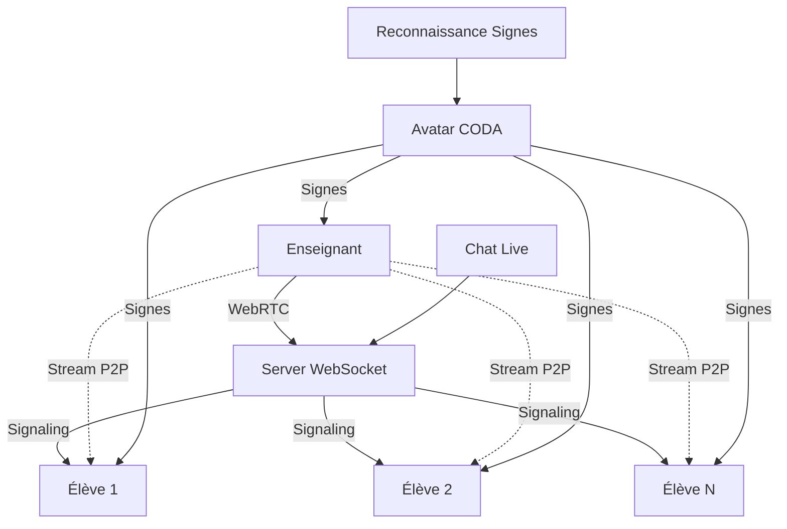

# 🎥 Système de Streaming Vidéo Bidirectionnel LSF

## 🎯 **Vue d'ensemble**

Le système de streaming vidéo bidirectionnel permet aux **enseignants et élèves** de se voir en temps réel pendant les cours de LSF, avec synchronisation de l'avatar CODA qui signe en réponse.

---

## 🏗️ **Architecture Streaming**



---

## 🎭 **Flux Bidirectionnel**

### **👩‍🏫 Côté Enseignant**
- **Capture vidéo** en temps réel (caméra + micro)
- **Diffusion WebRTC** vers tous les élèves
- **Reconnaissance de signes** sur sa propre vidéo
- **Avatar CODA** qui réagit et signe en retour
- **Gestion de la room** (création, participants)
- **Chat live** avec tous les élèves

### **👨‍🎓 Côté Élève**
- **Réception vidéo** de l'enseignant en direct
- **Avatar CODA synchronisé** qui signe les mêmes choses
- **Interface d'interaction** avec l'avatar
- **Chat live** avec l'enseignant et autres élèves
- **Feedback contextuels** (j'ai compris, question, etc.)

---

## 🚀 **Utilisation Complète**

### **Studio Streaming Complet**
```tsx
import { LiveStreamingStudio } from '@/learning/video';

// Interface enseignant
function TeacherApp() {
  return (
    <LiveStreamingStudio
      mode="teacher"
      userId="teacher_123"
      userName="Marie Dupont"
    />
  );
}

// Interface élève
function StudentApp() {
  return (
    <LiveStreamingStudio
      mode="student"
      userId="student_456"
      userName="Paul Martin"
      roomId="room_abc123"  // Auto-join
    />
  );
}
```

### **Interfaces Séparées**
```tsx
import { 
  TeacherVideoInterface, 
  StudentVideoInterface, 
  CODAAvatar3D 
} from '@/learning/video';

// Interface enseignant avec streaming
function TeacherInterface() {
  return (
    <TeacherVideoInterface
      teacherId="teacher_123"
      onRoomCreated={(roomId) => {
        console.log('Room créée:', roomId);
        // Partager roomId avec les élèves
      }}
      onSessionStart={(sessionId) => {
        console.log('Session:', sessionId);
      }}
    />
  );
}

// Interface élève avec flux entrant
function StudentInterface() {
  return (
    <StudentVideoInterface
      studentId="student_456"
      studentName="Paul Martin"
      roomId="room_abc123"
      onJoinRoom={(roomId) => {
        console.log('Rejoint room:', roomId);
      }}
    />
  );
}
```

### **Service Streaming Direct**
```tsx
import { useVideoStreaming } from '@/learning/video';

function CustomStreamingComponent() {
  const streaming = useVideoStreaming('user_123', 'teacher');

  const startTeaching = async () => {
    // Démarrer le flux local
    await streaming.startLocalStream();
    
    // Créer une room
    const roomId = await streaming.createRoom('Cours LSF A2');
    
    console.log('Room créée:', roomId);
    console.log('Partager ce code avec vos élèves');
  };

  const joinClass = async () => {
    await streaming.joinRoom('room_abc123', 'Mon nom');
  };

  return (
    <div>
      <button onClick={startTeaching}>🎬 Créer un cours</button>
      <button onClick={joinClass}>📚 Rejoindre un cours</button>
      
      <div>
        Participants: {streaming.connectedPeersCount}
        Room: {streaming.currentRoom}
      </div>
    </div>
  );
}
```

---

## 🔧 **Configuration WebRTC**

### **Serveurs STUN/TURN**
```typescript
const config = {
  iceServers: [
    { urls: 'stun:stun.l.google.com:19302' },
    { urls: 'stun:stun1.l.google.com:19302' },
    // Ajouter serveurs TURN pour production
    {
      urls: 'turn:your-turn-server.com:3478',
      username: 'user',
      credential: 'pass'
    }
  ]
};
```

### **Contraintes Vidéo**
```typescript
const videoConstraints = {
  width: { ideal: 1280, max: 1920 },
  height: { ideal: 720, max: 1080 },
  frameRate: { ideal: 30, max: 60 },
  facingMode: 'user',
  // Qualité optimisée pour signes LSF
  aspectRatio: 16/9
};
```

### **WebSocket de Signalisation**
```typescript
// URL par défaut (modifier selon votre serveur)
const wsUrl = 'ws://localhost:8080/video-streaming';

const streaming = useVideoStreaming('user_id', 'teacher', wsUrl);
```

---

## 🤖 **Synchronisation Avatar**

### **Avatar Réactif aux Signes**
```typescript
// L'avatar réagit automatiquement aux signes reconnus
const handleSignRecognized = async (sign: SignRecognitionResult) => {
  // Avatar répète le signe si confiance > 70%
  if (sign.confidence > 0.7) {
    await avatar.playSign(sign.signName);
    
    // Émotion selon la confiance
    if (sign.confidence > 0.9) {
      avatar.setEmotional('excited');
    } else {
      avatar.setEmotional('focused');
    }
  }
};
```

### **Avatar Contextualisé**
```typescript
// Événements de session
streaming.on('participant-joined', () => {
  avatar.playSign('bonjour');
  avatar.setEmotional('happy');
});

streaming.on('participant-left', () => {
  avatar.playSign('au_revoir');
  avatar.setEmotional('neutral');
});
```

---

## 📊 **Gestion des Participants**

### **Événements Temps Réel**
```typescript
const streaming = useVideoStreaming('user_id', 'teacher');

// Nouveau participant
streaming.participants.forEach(participant => {
  console.log('Participant:', {
    id: participant.id,
    name: participant.name,
    role: participant.role,
    isConnected: participant.isConnected
  });
});

// Statistiques
const stats = await streaming.getStats();
console.log('Connexions actives:', stats.connectedPeers);
console.log('Qualité streaming:', stats.connectionStates);
```

### **Chat Intégré**
```typescript
// Le LiveStreamingStudio inclut un chat live
const [messages, setMessages] = useState([]);

const sendMessage = (text: string) => {
  const message = {
    from: userName,
    message: text,
    timestamp: Date.now()
  };
  
  setMessages(prev => [...prev, message]);
  
  // Analyser pour réactions avatar
  if (text.includes('merci')) {
    avatar.playSign('merci');
  }
};
```

---

## 🛠️ **Types et Interfaces**

### **Service de Streaming**
```typescript
interface VideoStreamingService {
  // Contrôles de flux
  startLocalStream(): Promise<MediaStream>;
  stopLocalStream(): void;
  
  // Gestion des rooms
  createRoom(roomName: string): Promise<string>;
  joinRoom(roomId: string, participantName: string): Promise<void>;
  leaveRoom(): Promise<void>;
  
  // États
  isStreamingConnected: boolean;
  currentRoomId: string | null;
  connectedPeersCount: number;
  participants: Map<string, StreamParticipant>;
}
```

### **Hook de Streaming**
```typescript
const streaming = useVideoStreaming(userId, role);

// États disponibles
streaming.isConnected        // WebSocket connecté
streaming.currentRoom        // Room actuelle
streaming.localStream        // Flux local (caméra)
streaming.remoteStreams      // Map des flux distants
streaming.participants       // Map des participants
streaming.isStreaming        // Stream actif
streaming.error             // Erreur éventuelle

// Actions disponibles
streaming.startLocalStream()
streaming.createRoom(name)
streaming.joinRoom(id, name)
streaming.leaveRoom()
```

---

## 🎯 **Scénarios d'Usage**

### **1. Cours Magistral**
```typescript
// Enseignant seul, plusieurs élèves regardent
<LiveStreamingStudio 
  mode="teacher"
  userId="prof_marie"
  userName="Marie Dupont"
/>

// Les élèves rejoignent avec le roomId
<LiveStreamingStudio 
  mode="student"
  userId="eleve_paul"
  userName="Paul Martin"
  roomId="room_cours_lsf_a2"
/>
```

### **2. Session Interactive**
```typescript
// Interface avec avatar très réactif
<div>
  <StudentVideoInterface 
    studentId="eleve_123"
    studentName="Sophie"
    roomId="room_interactive"
  />
  
  {/* Avatar synchronisé avec interactions */}
  <div className="avatar-interactions">
    <button onClick={() => avatar.playSign('oui')}>
      👍 J'ai compris
    </button>
    <button onClick={() => avatar.playSign('non')}>
      ❓ Question
    </button>
  </div>
</div>
```

### **3. Streaming Multi-Classes**
```typescript
// Plusieurs rooms simultanées
const rooms = [
  { id: 'room_a1', name: 'LSF Débutant A1' },
  { id: 'room_a2', name: 'LSF Intermédiaire A2' },
  { id: 'room_b1', name: 'LSF Avancé B1' }
];

// Chaque enseignant crée sa room
rooms.forEach(room => {
  const teacherComponent = (
    <TeacherVideoInterface
      teacherId={`teacher_${room.id}`}
      onRoomCreated={(roomId) => {
        console.log(`Room ${room.name} créée:`, roomId);
      }}
    />
  );
});
```

---

## 🔧 **Serveur WebSocket Nécessaire**

Le système nécessite un serveur WebSocket pour la signalisation WebRTC :

### **Server Node.js Minimal**
```javascript
const WebSocket = require('ws');
const wss = new WebSocket.Server({ port: 8080, path: '/video-streaming' });

const rooms = new Map();

wss.on('connection', (ws) => {
  ws.on('message', (data) => {
    const message = JSON.parse(data);
    
    // Router les messages selon le type
    switch (message.type) {
      case 'join-room':
        handleJoinRoom(ws, message);
        break;
      case 'offer':
      case 'answer':
      case 'ice-candidate':
        relayToParticipant(message);
        break;
    }
  });
});

function handleJoinRoom(ws, message) {
  // Ajouter participant à la room
  // Notifier les autres participants
}

function relayToParticipant(message) {
  // Relayer les messages WebRTC
}
```

---

## 📈 **Monitoring et Debug**

### **Statistiques Temps Réel**
```typescript
// Stats détaillées
const stats = await streaming.getStats();

console.log('Streaming Stats:', {
  isConnected: stats.isConnected,
  currentRoom: stats.currentRoom,
  localStreamActive: stats.localStreamActive,
  connectedPeers: stats.connectedPeers,
  participants: stats.participants
});

// Quality monitoring
stats.participants.forEach(participant => {
  console.log(`Peer ${participant.peerId}:`, {
    connectionState: participant.connectionState,
    iceConnectionState: participant.iceConnectionState
  });
});
```

### **Debug Avatar**
```tsx
<CODAAvatar3D
  isActive={true}
  currentSign={avatar.currentSign}
  emotional={avatar.emotional}
  showDebugInfo={true}  // Affiche le panneau debug
/>
```

---

## 🎨 **Personnalisation**

### **Thèmes d'Interface**
```css
/* Variables CSS personnalisables */
:root {
  --streaming-primary: #4facfe;
  --streaming-secondary: #667eea;
  --avatar-bg: linear-gradient(135deg, #667eea 0%, #764ba2 100%);
  --chat-bg: #f8f9fa;
}
```

### **Avatar Émotions Custom**
```typescript
// Ajouter nouvelles émotions
avatar.setEmotional('super_excited'); // Custom
avatar.setEmotional('slightly_confused'); // Custom

// Ou réactions personnalisées
const customReactions = {
  'tres_bien': ['oui', 'merci', 'bonjour'],
  'pas_compris': ['non', 'au_revoir']
};
```

---

## 🚀 **Roadmap Streaming**

- [ ] **Enregistrement des sessions** - Sauvegarde cours complets
- [ ] **Streaming vers YouTube/Twitch** - Diffusion publique
- [ ] **Salles de sous-groupes** - Breakout rooms automatiques
- [ ] **Partage d'écran** - Présentation de supports
- [ ] **Annotations temps réel** - Dessiner sur la vidéo
- [ ] **Traduction automatique** - Sous-titres LSF ↔ Français
- [ ] **Mode offline** - Cours pré-enregistrés avec avatar

---

## 📞 **Support Streaming**

Pour toute question sur le streaming vidéo :
- 📧 Email: streaming@metasign.com  
- 💬 Discord: #video-streaming-lsf
- 📖 Docs: https://docs.metasign.com/streaming

**Le futur de l'enseignement LSF est en direct ! 🎥✨👋**